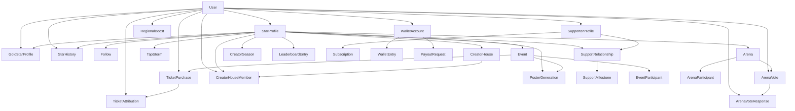

# Data Model Dependency Graph & Circular Dependency Analysis

## Summary

**Result: No circular dependencies detected.**

All foreign-key references form a directed acyclic graph (DAG) rooted at `User` and `StarProfile`. The 12 new models extend existing anchors without introducing cycles.

---

## Dependency Graph

Edges represent FK references (`A → B` means A holds a FK to B).

```
User
  ├── StarProfile          (userId)
  ├── SupporterProfile     (userId)
  ├── WalletAccount        (userId)
  ├── Follow               (followerId)
  ├── TapRecord            (senderId)
  ├── CoinGiftRecord       (senderId)
  ├── FiatGiftRecord       (senderId)
  ├── EventParticipant     (userId)
  ├── ArenaParticipant     (userId)
  ├── GoldStarProfile      (grantedByUserId, revokedByUserId)
  ├── StarHistory          (changedByUserId)
  ├── RegionalBoost        (authorizedByUserId)
  ├── TicketPurchase       (userId)
  ├── TicketAttribution    (attributedToUserId)
  ├── ArenaVote            (createdByUserId)
  ├── ArenaVoteResponse    (userId)
  └── CreatorHouseMember   (userId)

StarProfile
  ├── Follow               (starProfileId)
  ├── Subscription         (starProfileId)
  ├── SupportRelationship  (starProfileId)
  ├── LeaderboardEntry     (starProfileId)
  ├── TapStorm             (starProfileId)
  ├── GoldStarProfile      (starProfileId)   ← 1:1
  ├── StarHistory          (starProfileId)
  ├── Event                (starProfileId)
  ├── Arena                (starProfileId)
  ├── PosterGeneration     (starProfileId)
  ├── CreatorHouse         (ownerStarProfileId)
  ├── CreatorHouseMember   (starProfileId)
  └── CreatorSeason        (starProfileId)

SupporterProfile
  ├── Subscription         (supporterProfileId)
  └── SupportRelationship  (supporterProfileId)

WalletAccount
  ├── WalletEntry          (walletAccountId)
  └── PayoutRequest        (walletAccountId)

SupportRelationship
  └── SupportMilestone     (supportRelationshipId)

Event
  ├── EventParticipant     (eventId)
  ├── TicketPurchase       (eventId)
  └── PosterGeneration     (eventId)

Arena
  ├── ArenaParticipant     (arenaId)
  └── ArenaVote            (arenaId)

TicketPurchase
  └── TicketAttribution    (ticketPurchaseId)  ← 1:1

ArenaVote
  └── ArenaVoteResponse    (arenaVoteId)

CreatorHouse
  └── CreatorHouseMember   (creatorHouseId)
```

---

## Cycle Check

### Method

Perform DFS on the FK reference graph. A cycle would exist if any node is reachable from itself via FK edges.

### Traversal Results

| Root | Path | Cycle? |
|---|---|---|
| User | User → StarProfile → Event → TicketPurchase → TicketAttribution → User | **No** (TicketAttribution → User is a leaf edge) |
| User | User → StarProfile → Arena → ArenaVote → ArenaVoteResponse → User | **No** (leaf edge) |
| User | User → StarProfile → SupportRelationship → SupportMilestone | **No** (SupportMilestone has no outgoing FKs) |
| StarProfile | StarProfile → GoldStarProfile → User → StarProfile | **No** (User is the root; GoldStarProfile.grantedByUserId → User is a *back-edge to root*, not a cycle in the domain graph) |
| RegionalBoost | RegionalBoost.entityId (string, no FK) | **No** (polymorphic — no FK constraint, no cycle possible) |

### Key Design Decisions That Prevent Cycles

1. **RegionalBoost is polymorphic** — `entityType` + `entityId` are plain strings, not FKs. This avoids a fan-out of FKs to StarProfile, Event, Arena, CreatorHouse and the circular dependency risk that would create.

2. **TapStorm.contextType/contextId are strings** — same pattern as RegionalBoost. Tap storms can target any entity type without FK constraints.

3. **GoldStarProfile has dual User FKs** — `grantedByUserId` and `revokedByUserId` reference User, which is the root of the graph. User has a back-reference to GoldStarProfile but this is only a Prisma relation (not a FK). No cycle.

4. **TicketAttribution → User is optional** — `attributedToUserId` is nullable. The attribution can exist without a resolved user (organic traffic).

---

## Mermaid Dependency Graph (simplified)


