# ER Diagram — New Models

This diagram shows the 12 new domain models and their connections to the existing anchor models (User, StarProfile, SupporterProfile, Arena, Event).

Existing models are shown in **bold** comments. New models are shown with full attribute lists.

```mermaid
erDiagram

  %% ── Existing anchor models (abbreviated) ─────────────────────────────────

  User {
    string id PK
  }

  StarProfile {
    string id PK
    string userId FK
  }

  SupporterProfile {
    string id PK
    string userId FK
  }

  Arena {
    string id PK
  }

  Event {
    string id PK
  }

  %% ── Support domain ────────────────────────────────────────────────────────

  SupportRelationship {
    string id PK
    string supporterProfileId FK
    string starProfileId FK
    SupportRelationshipStatus status
    int totalTaps
    int totalCoinsGifted
    int totalFiatGiftedCents
    int streakDays
    int tier
    DateTime firstInteractionAt
    DateTime lastInteractionAt
    DateTime createdAt
    DateTime updatedAt
  }

  SupportMilestone {
    string id PK
    string supportRelationshipId FK
    SupportMilestoneType type
    Json metadata
    bool notified
    DateTime achievedAt
    DateTime createdAt
  }

  SupporterProfile ||--o{ SupportRelationship : "supporterProfileId"
  StarProfile ||--o{ SupportRelationship : "starProfileId"
  SupportRelationship ||--o{ SupportMilestone : "supportRelationshipId"

  %% ── Star domain ───────────────────────────────────────────────────────────

  GoldStarProfile {
    string id PK
    string starProfileId FK
    GoldStarStatus status
    string grantedByUserId FK
    string revokedByUserId FK
    string reason
    DateTime grantedAt
    DateTime expiresAt
    DateTime revokedAt
    DateTime createdAt
    DateTime updatedAt
  }

  StarHistory {
    string id PK
    string starProfileId FK
    StarHistoryEventType eventType
    Json previousState
    Json nextState
    string changedByUserId FK
    DateTime occurredAt
    DateTime createdAt
  }

  StarProfile ||--o| GoldStarProfile : "starProfileId"
  StarProfile ||--o{ StarHistory : "starProfileId"
  User ||--o{ GoldStarProfile : "grantedByUserId"
  User ||--o{ GoldStarProfile : "revokedByUserId"
  User ||--o{ StarHistory : "changedByUserId"

  %% ── Discovery domain ──────────────────────────────────────────────────────

  RegionalBoost {
    string id PK
    string region
    RegionalEntityType entityType
    string entityId
    float boostScore
    string authorizedByUserId FK
    DateTime startsAt
    DateTime endsAt
    bool active
    DateTime createdAt
    DateTime updatedAt
  }

  User ||--o{ RegionalBoost : "authorizedByUserId"

  %% ── Tap domain ────────────────────────────────────────────────────────────

  TapStorm {
    string id PK
    string starProfileId FK
    string contextType
    string contextId
    TapStormStatus status
    int targetTaps
    int currentTaps
    DateTime scheduledAt
    DateTime startedAt
    DateTime endedAt
    DateTime createdAt
    DateTime updatedAt
  }

  StarProfile ||--o{ TapStorm : "starProfileId"

  %% ── Event/Ticket domain ───────────────────────────────────────────────────

  TicketPurchase {
    string id PK
    string eventId FK
    string userId FK
    int quantityPurchased
    int unitPriceCents
    string currency
    TicketPurchaseStatus status
    string idempotencyKey UK
    Json metadata
    DateTime purchasedAt
    DateTime confirmedAt
    DateTime refundedAt
    DateTime createdAt
    DateTime updatedAt
  }

  TicketAttribution {
    string id PK
    string ticketPurchaseId FK
    TicketAttributionType attributionType
    string campaignId
    string referrerCode
    string attributedToUserId FK
    Json metadata
    DateTime createdAt
  }

  Event ||--o{ TicketPurchase : "eventId"
  User ||--o{ TicketPurchase : "userId"
  TicketPurchase ||--o| TicketAttribution : "ticketPurchaseId"
  User ||--o{ TicketAttribution : "attributedToUserId"

  %% ── Creator OS domain ─────────────────────────────────────────────────────

  PosterGeneration {
    string id PK
    string starProfileId FK
    string eventId FK
    string prompt
    string imageUrl
    string modelVersion
    PosterGenerationStatus status
    Json metadata
    DateTime createdAt
    DateTime updatedAt
  }

  CreatorHouse {
    string id PK
    string name
    string slug UK
    string description
    string avatarUrl
    string bannerUrl
    string ownerStarProfileId FK
    CreatorHouseStatus status
    int memberCount
    DateTime createdAt
    DateTime updatedAt
  }

  CreatorHouseMember {
    string id PK
    string creatorHouseId FK
    string starProfileId FK
    string userId FK
    string role
    DateTime joinedAt
    DateTime leftAt
    DateTime createdAt
  }

  CreatorSeason {
    string id PK
    string starProfileId FK
    string name
    int number
    string description
    string coverImageUrl
    CreatorSeasonStatus status
    int totalCoinsEarned
    int totalEvents
    DateTime startsAt
    DateTime endsAt
    DateTime createdAt
    DateTime updatedAt
  }

  StarProfile ||--o{ PosterGeneration : "starProfileId"
  Event ||--o{ PosterGeneration : "eventId"
  StarProfile ||--o{ CreatorHouse : "ownerStarProfileId"
  CreatorHouse ||--o{ CreatorHouseMember : "creatorHouseId"
  StarProfile ||--o{ CreatorHouseMember : "starProfileId"
  User ||--o{ CreatorHouseMember : "userId"
  StarProfile ||--o{ CreatorSeason : "starProfileId"

  %% ── Arena vote domain ─────────────────────────────────────────────────────

  ArenaVote {
    string id PK
    string arenaId FK
    string createdByUserId FK
    string question
    Json options
    ArenaVoteStatus status
    int totalVotes
    DateTime endsAt
    DateTime closedAt
    DateTime createdAt
    DateTime updatedAt
  }

  ArenaVoteResponse {
    string id PK
    string arenaVoteId FK
    string userId FK
    string optionId
    DateTime createdAt
  }

  Arena ||--o{ ArenaVote : "arenaId"
  User ||--o{ ArenaVote : "createdByUserId"
  ArenaVote ||--o{ ArenaVoteResponse : "arenaVoteId"
  User ||--o{ ArenaVoteResponse : "userId"
```

