# ER Diagram — Full Overview

Complete entity-relationship diagram for the STARRIA platform, covering all ~32 models (16 existing + 14 new including 2 implicit join/response tables).

> **Tip:** Open this file in a Markdown viewer with Mermaid support (GitHub, VS Code with Mermaid extension, or mermaid.live).

```mermaid
erDiagram

  %% ═══════════════════════════════════════════════════
  %% IDENTITY
  %% ═══════════════════════════════════════════════════

  User {
    string id PK
    string email UK
    string displayName
    DateTime createdAt
    DateTime updatedAt
  }

  StarProfile {
    string id PK
    string userId FK
    string handle UK
    VerificationStatus verificationStatus
    int tier
    int followerCount
    DateTime createdAt
    DateTime updatedAt
  }

  SupporterProfile {
    string id PK
    string userId FK
    int totalSpentCoins
    DateTime createdAt
    DateTime updatedAt
  }

  User ||--o| StarProfile : "userId"
  User ||--o| SupporterProfile : "userId"

  %% ═══════════════════════════════════════════════════
  %% SOCIAL
  %% ═══════════════════════════════════════════════════

  Follow {
    string id PK
    string followerId FK
    string starProfileId FK
    DateTime createdAt
  }

  Subscription {
    string id PK
    string supporterProfileId FK
    string starProfileId FK
    bool active
    DateTime renewsAt
    DateTime createdAt
    DateTime updatedAt
  }

  User ||--o{ Follow : "followerId"
  StarProfile ||--o{ Follow : "starProfileId"
  SupporterProfile ||--o{ Subscription : "supporterProfileId"
  StarProfile ||--o{ Subscription : "starProfileId"

  %% ═══════════════════════════════════════════════════
  %% SUPPORT RELATIONSHIPS
  %% ═══════════════════════════════════════════════════

  SupportRelationship {
    string id PK
    string supporterProfileId FK
    string starProfileId FK
    SupportRelationshipStatus status
    int totalTaps
    int totalCoinsGifted
    int totalFiatGiftedCents
    int streakDays
    int tier
    DateTime firstInteractionAt
    DateTime lastInteractionAt
  }

  SupportMilestone {
    string id PK
    string supportRelationshipId FK
    SupportMilestoneType type
    Json metadata
    bool notified
    DateTime achievedAt
  }

  SupporterProfile ||--o{ SupportRelationship : "supporterProfileId"
  StarProfile ||--o{ SupportRelationship : "starProfileId"
  SupportRelationship ||--o{ SupportMilestone : "supportRelationshipId"

  %% ═══════════════════════════════════════════════════
  %% WALLET
  %% ═══════════════════════════════════════════════════

  WalletAccount {
    string id PK
    string userId FK
    WalletCurrency currency
    int balanceCoins
    int balanceFiatCents
    DateTime createdAt
    DateTime updatedAt
  }

  WalletEntry {
    string id PK
    string walletAccountId FK
    WalletEntryType type
    int amountCoins
    int amountFiatCents
    string referenceId
    string previousHash
    string hash
    DateTime createdAt
  }

  PayoutRequest {
    string id PK
    string walletAccountId FK
    int amountCents
    PayoutStatus status
    DateTime createdAt
    DateTime updatedAt
  }

  User ||--o{ WalletAccount : "userId"
  WalletAccount ||--o{ WalletEntry : "walletAccountId"
  WalletAccount ||--o{ PayoutRequest : "walletAccountId"

  %% ═══════════════════════════════════════════════════
  %% GIFTING & TAPS
  %% ═══════════════════════════════════════════════════

  CoinGiftRecord {
    string id PK
    string senderId FK
    string recipientId FK
    GiftTargetType targetType
    string targetId
    int coinsAmount
    DateTime createdAt
  }

  FiatGiftRecord {
    string id PK
    string senderId FK
    string recipientId FK
    GiftTargetType targetType
    string targetId
    int amountCents
    string currency
    DateTime createdAt
  }

  TapRecord {
    string id PK
    string senderId FK
    string recipientId FK
    string targetType
    string targetId
    int coinsAmount
    DateTime createdAt
  }

  LeaderboardEntry {
    string id PK
    string starProfileId FK
    string period
    int rank
    int totalTaps
    int totalCoins
    DateTime updatedAt
  }

  TapStorm {
    string id PK
    string starProfileId FK
    string contextType
    string contextId
    TapStormStatus status
    int targetTaps
    int currentTaps
    DateTime scheduledAt
    DateTime startedAt
    DateTime endedAt
  }

  User ||--o{ CoinGiftRecord : "senderId"
  User ||--o{ FiatGiftRecord : "senderId"
  User ||--o{ TapRecord : "senderId"
  StarProfile ||--o{ LeaderboardEntry : "starProfileId"
  StarProfile ||--o{ TapStorm : "starProfileId"

  %% ═══════════════════════════════════════════════════
  %% STAR PROFILE EXTENSIONS
  %% ═══════════════════════════════════════════════════

  GoldStarProfile {
    string id PK
    string starProfileId FK
    GoldStarStatus status
    string grantedByUserId FK
    string revokedByUserId FK
    DateTime grantedAt
    DateTime expiresAt
    DateTime revokedAt
  }

  StarHistory {
    string id PK
    string starProfileId FK
    StarHistoryEventType eventType
    Json previousState
    Json nextState
    string changedByUserId FK
    DateTime occurredAt
  }

  StarProfile ||--o| GoldStarProfile : "starProfileId"
  StarProfile ||--o{ StarHistory : "starProfileId"
  User ||--o{ GoldStarProfile : "grantedByUserId"
  User ||--o{ StarHistory : "changedByUserId"

  %% ═══════════════════════════════════════════════════
  %% DISCOVERY
  %% ═══════════════════════════════════════════════════

  RegionalBoost {
    string id PK
    string region
    RegionalEntityType entityType
    string entityId
    float boostScore
    string authorizedByUserId FK
    bool active
    DateTime startsAt
    DateTime endsAt
  }

  User ||--o{ RegionalBoost : "authorizedByUserId"

  %% ═══════════════════════════════════════════════════
  %% EVENTS & TICKETS
  %% ═══════════════════════════════════════════════════

  Event {
    string id PK
    string starProfileId FK
    EventType type
    EventStatus status
    string title
    DateTime scheduledAt
    DateTime startedAt
    DateTime endedAt
    DateTime createdAt
  }

  EventParticipant {
    string id PK
    string eventId FK
    string userId FK
    DateTime joinedAt
    DateTime leftAt
  }

  TicketPurchase {
    string id PK
    string eventId FK
    string userId FK
    int quantityPurchased
    int unitPriceCents
    string currency
    TicketPurchaseStatus status
    string idempotencyKey UK
    DateTime purchasedAt
  }

  TicketAttribution {
    string id PK
    string ticketPurchaseId FK
    TicketAttributionType attributionType
    string campaignId
    string referrerCode
    string attributedToUserId FK
    DateTime createdAt
  }

  PosterGeneration {
    string id PK
    string starProfileId FK
    string eventId FK
    string prompt
    string imageUrl
    PosterGenerationStatus status
    DateTime createdAt
  }

  StarProfile ||--o{ Event : "starProfileId"
  Event ||--o{ EventParticipant : "eventId"
  User ||--o{ EventParticipant : "userId"
  Event ||--o{ TicketPurchase : "eventId"
  User ||--o{ TicketPurchase : "userId"
  TicketPurchase ||--o| TicketAttribution : "ticketPurchaseId"
  User ||--o{ TicketAttribution : "attributedToUserId"
  StarProfile ||--o{ PosterGeneration : "starProfileId"
  Event ||--o{ PosterGeneration : "eventId"

  %% ═══════════════════════════════════════════════════
  %% ARENA & VOTES
  %% ═══════════════════════════════════════════════════

  Arena {
    string id PK
    string starProfileId FK
    ArenaStatus status
    string title
    int participantCount
    DateTime createdAt
  }

  ArenaParticipant {
    string id PK
    string arenaId FK
    string userId FK
    ParticipantRole role
    DateTime joinedAt
    DateTime leftAt
  }

  ArenaVote {
    string id PK
    string arenaId FK
    string createdByUserId FK
    string question
    Json options
    ArenaVoteStatus status
    int totalVotes
    DateTime endsAt
    DateTime closedAt
  }

  ArenaVoteResponse {
    string id PK
    string arenaVoteId FK
    string userId FK
    string optionId
    DateTime createdAt
  }

  StarProfile ||--o{ Arena : "starProfileId"
  Arena ||--o{ ArenaParticipant : "arenaId"
  User ||--o{ ArenaParticipant : "userId"
  Arena ||--o{ ArenaVote : "arenaId"
  User ||--o{ ArenaVote : "createdByUserId"
  ArenaVote ||--o{ ArenaVoteResponse : "arenaVoteId"
  User ||--o{ ArenaVoteResponse : "userId"

  %% ═══════════════════════════════════════════════════
  %% CREATOR OS
  %% ═══════════════════════════════════════════════════

  CreatorHouse {
    string id PK
    string slug UK
    string name
    string ownerStarProfileId FK
    CreatorHouseStatus status
    int memberCount
    DateTime createdAt
  }

  CreatorHouseMember {
    string id PK
    string creatorHouseId FK
    string starProfileId FK
    string userId FK
    string role
    DateTime joinedAt
    DateTime leftAt
  }

  CreatorSeason {
    string id PK
    string starProfileId FK
    string name
    int number
    CreatorSeasonStatus status
    int totalCoinsEarned
    int totalEvents
    DateTime startsAt
    DateTime endsAt
  }

  StarProfile ||--o{ CreatorHouse : "ownerStarProfileId"
  CreatorHouse ||--o{ CreatorHouseMember : "creatorHouseId"
  StarProfile ||--o{ CreatorHouseMember : "starProfileId"
  User ||--o{ CreatorHouseMember : "userId"
  StarProfile ||--o{ CreatorSeason : "starProfileId"
```

