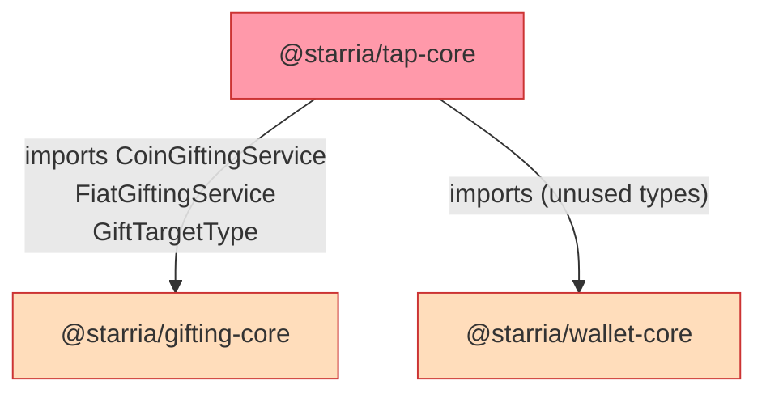
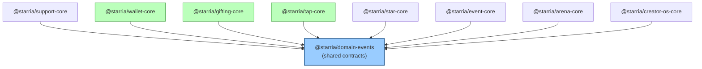
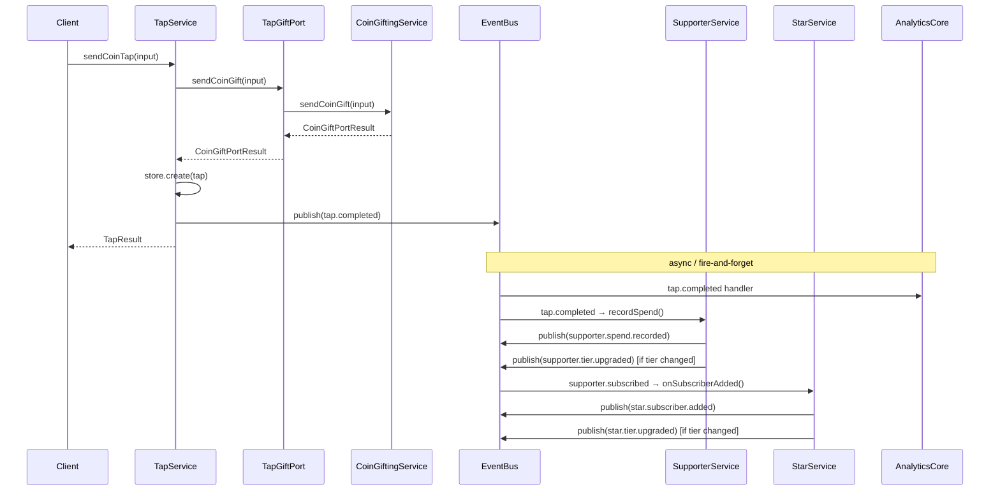
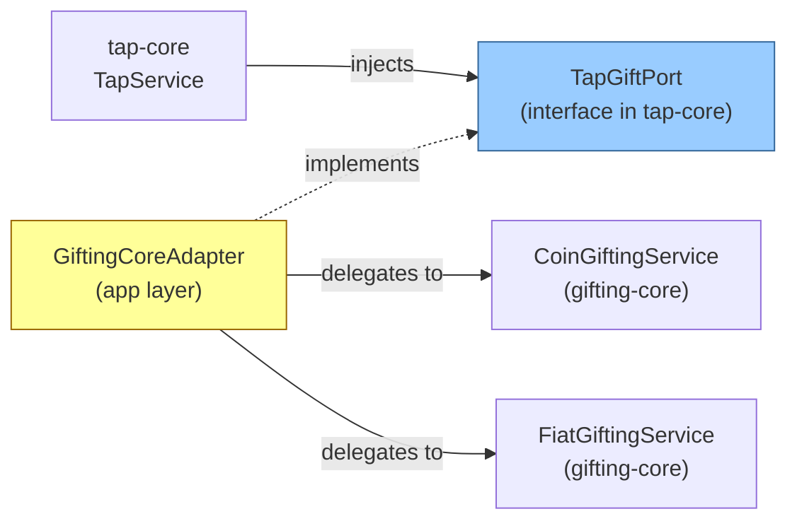

# Package Dependency Diagram

## Before Refactor

Direct runtime imports between domain packages:



Cross-service orchestration happened at the app layer (NestJS modules) through direct service-to-service calls — invisible in the package graph but still tightly coupled:

```
TapService.sendCoinTap()
  └── calls: SupporterService.recordSpend()   [app layer coupling]
  └── calls: StarService.syncTier()           [app layer coupling]

SupporterService.subscribe()
  └── calls: StarService.syncTier()           [app layer coupling]
  └── calls: StarService.onSubscriberAdded()  [app layer coupling]
```

---

## After Refactor

### Package-Level Dependencies



**Zero direct runtime dependencies between domain packages.** All depend only on `@starria/domain-events`.

---

### Event Bus Message Flow



---

### TapGiftPort Adapter (eliminates tap-core → gifting-core dep)



The adapter lives in the app layer (`apps/api/`), not in any domain package. This keeps gifting-core's service implementations decoupled from tap-core's type system.

---

### Full Dependency Matrix (after refactor)

| Package | Depends On | Depended On By |
|---|---|---|
| `domain-events` | — | all packages |
| `support-core` | domain-events | app layer |
| `wallet-core` | domain-events | app layer |
| `gifting-core` | domain-events | app layer (via adapter) |
| `tap-core` | domain-events | app layer |
| `star-core` | domain-events | app layer |
| `event-core` | domain-events | app layer |
| `arena-core` | domain-events | app layer |
| `creator-os-core` | domain-events | app layer |

All cross-domain coupling is now mediated by the event bus at runtime, with the app layer as the only place that wires packages together.
